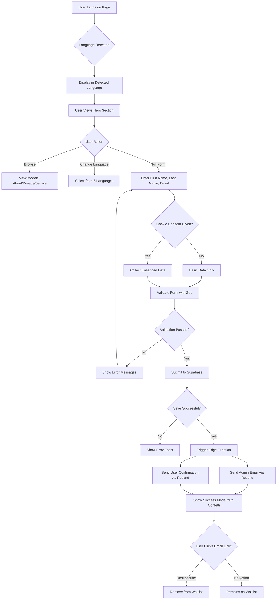
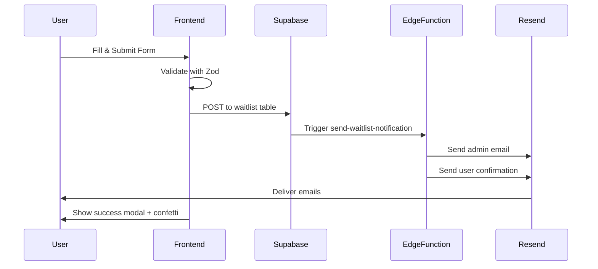
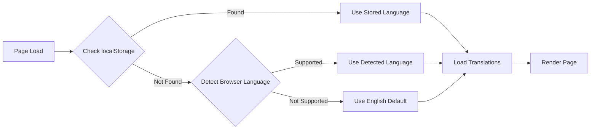

# Lifeli.me Landing Page - Complete Blueprint

## Executive Summary

**Project Name:** Lifeli.me Waitlist Landing Page  
**Purpose:** Multi-language waitlist capture system for lifeli.me product launch  
**Target Audience:** International users interested in the lifeli.me platform  
**Key Objectives:**
- Capture qualified leads with comprehensive user data
- Provide seamless multi-language experience (6 languages)
- Send automated email notifications to both admin and users
- Ensure GDPR compliance with cookie consent
- Create engaging, responsive UI with brand consistency

---

## User Journey & Flow

### Complete User Flow Diagram



### Step-by-Step Interaction

1. **Landing (0s)**
   - Page loads with animated gradient background
   - Language auto-detected based on browser settings
   - Logo and hero content displayed in detected language

2. **Exploration (0-30s)**
   - User reads value proposition
   - May click modals: About (with YouTube video), Privacy Policy, Service Members
   - May change language using language switcher (top-right)

3. **Form Interaction (30s-2min)**
   - User focuses on First Name input → floating label animates up
   - User enters Last Name → floating label animates up
   - User enters Email → floating label animates up
   - Real-time validation feedback on blur

4. **Cookie Consent (before submit)**
   - Cookie banner appears on first visit
   - User accepts → enhanced data collection enabled
   - User rejects → basic data only

5. **Submission (2min)**
   - User clicks "Join the Waitlist" button
   - Form validates with Zod schema
   - Data posted to Supabase `/waitlist` table
   - Edge function triggered automatically

6. **Confirmation (2min+)**
   - Success modal appears with confetti animation
   - Admin receives notification email
   - User receives confirmation email with unsubscribe link
   - Form resets for potential additional entries

---

## Technical Architecture

### Frontend Stack

```
┌─────────────────────────────────────────┐
│         React 18.3.1 + TypeScript       │
├─────────────────────────────────────────┤
│  Vite (Build Tool & Dev Server)         │
│  React Router DOM 6.30.1 (Routing)      │
│  React Hook Form 7.61.1 (Form Mgmt)     │
│  Zod 3.25.76 (Validation)               │
│  i18next 25.6.0 (Internationalization)  │
│  Tailwind CSS (Styling)                 │
│  Shadcn UI (Component Library)          │
│  Canvas Confetti (Animations)           │
└─────────────────────────────────────────┘
```

### Backend Architecture

```
┌──────────────────────────────────────────────┐
│            Lovable Cloud (Supabase)          │
├──────────────────────────────────────────────┤
│  PostgreSQL Database                         │
│  - waitlist table                            │
│  - user_roles table                          │
│                                              │
│  Edge Functions (Deno)                       │
│  - send-waitlist-notification                │
│  - unsubscribe-waitlist                      │
│                                              │
│  Storage                                     │
│  - assets bucket (public)                    │
└──────────────────────────────────────────────┘
```

### Email System (Resend)

```
┌─────────────────────────────────────────┐
│         Resend Email Service            │
├─────────────────────────────────────────┤
│  Admin Notification Template            │
│  - React Email Component                │
│  - Personalized with user data          │
│  - Founder photo header                 │
│                                         │
│  User Confirmation Template             │
│  - React Email Component                │
│  - Multi-language subject lines         │
│  - Unsubscribe link                     │
│  - Founder photo & signature            │
└─────────────────────────────────────────┘
```

### Data Flow



---

## Features & Functionality

### 1. Waitlist Form

**Fields:**
- First Name (required, 2+ characters)
- Last Name (optional, 2+ characters if provided)
- Email (required, valid email format)

**Validation (Zod Schema):**
```typescript
{
  firstName: z.string().min(2, "First name must be at least 2 characters"),
  lastName: z.string().min(2, "Last name must be at least 2 characters").optional().or(z.literal("")),
  email: z.string().email("Please enter a valid email address")
}
```

**Features:**
- Floating label inputs (animate on focus/value)
- Real-time error display
- Submit button with loading state
- Duplicate email prevention

### 2. Multi-Language Support

**Supported Languages:**
1. English (EN) - Default
2. French (FR)
3. German (DE)
4. Czech (CZ)
5. Spanish (ES)
6. Polish (PL)

**Implementation:**
- `i18next` with browser language detection
- JSON translation files in `src/i18n/locales/`
- Language switcher component (top-right)
- Persistent language selection (localStorage)
- Email subjects change based on user's selected language

### 3. Cookie Consent & Data Collection

**Basic Data (Always Collected):**
- First name
- Last name
- Email address
- Timestamp

**Enhanced Data (With Consent):**
- Browser info (name, version)
- OS name
- Screen resolution (width, height)
- User agent string
- Language preference
- Timezone
- Location (country, region, city) - via IP
- Consent timestamp

### 4. Email Notifications

**Admin Notification:**
- Sent to: admin@lifeli.me
- Subject: "🎉 New Waitlist Registration!"
- Content: All user data in formatted table
- Header: Founder photo (Adam Trnka)
- Signature: Contact info + social links

**User Confirmation:**
- Sent to: user's email
- Subject: Multi-language (e.g., "Welcome to the Lifeli.me Waitlist! 🌟")
- Content: Personalized greeting, next steps
- Header: Founder photo
- Footer: Unsubscribe link + social links
- CTA: "Learn More About Lifeli.me"

### 5. Unsubscribe Functionality

**Flow:**
1. User clicks unsubscribe link in email
2. Link format: `/unsubscribe?email={email}&token={token}`
3. Edge function validates token
4. Record removed from waitlist table
5. Confirmation page displayed

**Security:**
- Token-based authentication
- Email verification required
- One-time use tokens

### 6. Modals

**About Modal:**
- YouTube video embed
- Founder story
- Project mission
- Contact information with photo

**Privacy Policy Modal:**
- GDPR compliance information
- Data collection disclosure
- User rights explanation
- Contact for privacy concerns

**Service Members Modal:**
- Dedicated to service members
- Founder information
- Special acknowledgment

### 7. UI/UX Features

**Desktop Layout:**
- Split screen design
- Left: Animated wave pattern background
- Right: Form with floating elements
- Purple gradient branding (#9b87f5 to #9333ea)

**Mobile Layout:**
- Unified gradient background
- Animated blob shapes
- Responsive form inputs
- Mobile-optimized navigation

**Animations:**
- Floating blob animations (CSS keyframes)
- Wave pattern (SVG animation)
- Confetti on success
- Smooth modal transitions
- Floating label animations

**Accessibility:**
- ARIA labels on all inputs
- Keyboard navigation support
- Focus states on interactive elements
- Screen reader friendly

---

## Database Schema

### `waitlist` Table

```sql
CREATE TABLE public.waitlist (
  -- Primary
  id UUID PRIMARY KEY DEFAULT gen_random_uuid(),
  created_at TIMESTAMP WITH TIME ZONE DEFAULT now() NOT NULL,
  
  -- User Information
  first_name TEXT,
  last_name TEXT,
  email TEXT NOT NULL,
  
  -- Consent & Preferences
  cookies_consent BOOLEAN DEFAULT false,
  consent_timestamp TIMESTAMP WITH TIME ZONE,
  language TEXT,
  timezone TEXT,
  
  -- Technical Data
  user_agent TEXT,
  browser_name TEXT,
  browser_version TEXT,
  os_name TEXT,
  screen_width INTEGER,
  screen_height INTEGER,
  
  -- Location Data (IP-based)
  location_country TEXT,
  location_region TEXT,
  location_city TEXT
);
```

**Row Level Security (RLS) Policies:**

1. **INSERT Policy:** "Anyone can register for waitlist"
   - Allows: Public insertions
   - Purpose: Enable anonymous form submissions

2. **SELECT Policy:** "Only admins can view waitlist entries"
   - Allows: Users with 'admin' role
   - Purpose: Protect user data privacy

3. **UPDATE/DELETE:** Disabled for standard users
   - Purpose: Data integrity and audit trail

**Indexes:**
- Primary key on `id`
- Unique index on `email` (prevents duplicates)
- Index on `created_at` (for date-based queries)

---

## Email System Details

### Template Structure

Both email templates use **React Email** components for consistent, responsive design.

**Shared Components:**
```typescript
import {
  Body,
  Container,
  Head,
  Heading,
  Html,
  Img,
  Link,
  Preview,
  Section,
  Text,
  Hr,
} from 'npm:@react-email/components@0.0.22';
```

### Admin Notification Template

**File:** `supabase/functions/send-waitlist-notification/_templates/admin-notification.tsx`

**Structure:**
1. **Header:** Founder photo (80x80, circular)
2. **Title:** "New Waitlist Registration!"
3. **Data Table:**
   - Name (First + Last)
   - Email
   - Browser & OS
   - Screen Resolution
   - Location (Country, Region, City)
   - Language & Timezone
   - Cookies Consent Status
   - Registration Date
4. **Signature:** Adam Trnka contact info
5. **Footer:** Social media links

**Styling:** 
- Purple gradient header
- White background
- Professional table layout
- Responsive design

### User Confirmation Template

**File:** `supabase/functions/send-waitlist-notification/_templates/waitlist-confirmation.tsx`

**Structure:**
1. **Header:** Purple gradient with founder photo
2. **Greeting:** Personalized with first name
3. **Main Content:**
   - Thank you message
   - What happens next
   - Value proposition
4. **CTA Button:** "Learn More About Lifeli.me"
5. **Signature:** Founder name + photo
6. **Footer:**
   - Unsubscribe link
   - Social media links
   - Physical address (if required)

**Multi-Language Subjects:**
```typescript
const subjects = {
  en: "Welcome to the Lifeli.me Waitlist! 🌟",
  fr: "Bienvenue sur la liste d'attente Lifeli.me! 🌟",
  de: "Willkommen auf der Lifeli.me Warteliste! 🌟",
  cz: "Vítejte na seznamu čekatelů Lifeli.me! 🌟",
  es: "¡Bienvenido a la lista de espera de Lifeli.me! 🌟",
  pl: "Witamy na liście oczekujących Lifeli.me! 🌟"
};
```

### Sender Configuration

**From Address:** `from: "Lifeli.me <onboarding@resend.dev>"`

**Note:** The sender avatar/photo in email clients (Gmail, Outlook, etc.) is controlled by:
1. Resend sender identity configuration
2. Gravatar association with sender email
3. Email client's contact list

The founder photo appears **in the email body**, not as the sender avatar.

---

## UI/UX Design

### Design System

**Color Palette (HSL):**
```css
:root {
  /* Primary Brand Colors */
  --primary: 280 65% 74%;        /* #9b87f5 */
  --primary-dark: 280 65% 60%;   /* #9333ea */
  
  /* Backgrounds */
  --background: 0 0% 100%;       /* White */
  --foreground: 222.2 84% 4.9%;  /* Dark text */
  
  /* UI Elements */
  --border: 214.3 31.8% 91.4%;
  --input: 214.3 31.8% 91.4%;
  --ring: 280 65% 74%;
  
  /* States */
  --destructive: 0 84.2% 60.2%;
  --muted: 210 40% 96.1%;
}
```

**Typography:**
- Font Family: System fonts stack
- Headings: Bold, large scale (36px - 64px)
- Body: 16px - 18px
- Small text: 14px

**Spacing System:**
- Based on Tailwind's spacing scale
- Consistent padding: 16px, 24px, 32px, 48px
- Gap between elements: 16px - 24px

### Desktop Layout (1024px+)

```
┌────────────────────────────────────────────────────┐
│  Logo          Language Switcher    Social Links   │
├──────────────────┬─────────────────────────────────┤
│                  │                                 │
│   Animated       │      Waitlist Form              │
│   Wave Pattern   │      • Floating Label Inputs    │
│   Background     │      • Submit Button            │
│   (Purple        │      • Footer Links             │
│   Gradient)      │                                 │
│                  │                                 │
│   Fixed Links:   │                                 │
│   - About        │                                 │
│   - Privacy      │                                 │
│   - Service      │                                 │
│                  │                                 │
└──────────────────┴─────────────────────────────────┘
```

### Mobile Layout (<768px)

```
┌─────────────────────────┐
│  Logo    Lang   Social  │
├─────────────────────────┤
│                         │
│   Full-Screen           │
│   Gradient Background   │
│   with Animated Blobs   │
│                         │
│   Waitlist Form         │
│   • First Name          │
│   • Last Name           │
│   • Email               │
│   • Submit Button       │
│                         │
│   Footer Links          │
│                         │
└─────────────────────────┘
```

### Component Breakdown

**HeroSection Component:**
- Main container with responsive layout
- Form management with React Hook Form
- Modal state management (4 modals)
- Integration with i18n for translations

**FloatingLabelInput Component:**
- Custom input with animated label
- Focus/blur state management
- Error display
- Required field indicator

**LanguageSwitcher Component:**
- Dropdown with flag icons
- Persistent selection
- Instant page translation

**Modal Components:**
- AboutModal: Video + founder story
- PrivacyPolicyModal: Legal text
- ServiceMembersModal: Dedication page
- WaitlistSuccessModal: Confirmation + confetti

**CookieConsent Component:**
- Banner at bottom of page
- Accept/Reject buttons
- Persists choice to localStorage

### Animation Details

**Floating Blobs (Mobile):**
```css
@keyframes float {
  0%, 100% { transform: translate(0, 0) scale(1); }
  33% { transform: translate(30px, -50px) scale(1.1); }
  66% { transform: translate(-20px, 20px) scale(0.9); }
}

animation: float 20s ease-in-out infinite;
```

**Wave Pattern (Desktop):**
- SVG-based animation
- Smooth wave motion
- Purple to dark purple gradient

**Confetti Effect:**
- Triggered on successful submission
- Canvas-based particle animation
- 3-second duration

---

## Internationalization

### Language Detection Flow



### Translation Structure

**File Location:** `src/i18n/locales/{lang}.json`

**Key Categories:**
```json
{
  "hero": {
    "title": "...",
    "subtitle": "...",
    "cta": "..."
  },
  "form": {
    "firstName": "...",
    "lastName": "...",
    "email": "...",
    "submit": "..."
  },
  "email": {
    "subject": "...",
    "greeting": "...",
    "body": "..."
  },
  "footer": {
    "about": "...",
    "privacy": "...",
    "service": "..."
  }
}
```

### Implementation

```typescript
// i18n configuration
i18n
  .use(LanguageDetector)
  .use(initReactI18next)
  .init({
    resources: { en, fr, de, cz, es, pl },
    fallbackLng: 'en',
    interpolation: { escapeValue: false }
  });

// Usage in components
const { t, i18n } = useTranslation();
<h1>{t('hero.title')}</h1>
```

---

## Video Recording Suggestions

### Recommended Recording Structure

#### 1. **Introduction (2 minutes)**
- Show landing page on desktop
- Quick overview: "This is a multi-language waitlist system"
- Highlight key features: 6 languages, email notifications, GDPR compliance

#### 2. **User Journey Demo (5 minutes)**

**A. Language Selection (30s)**
- Show language switcher
- Switch between 2-3 languages
- Show how all text updates instantly

**B. Form Interaction (2 min)**
- Fill out form with floating labels
- Show validation errors (empty fields, invalid email)
- Show correct format
- Accept cookie consent

**C. Submission & Confirmation (1 min)**
- Submit form
- Show success modal with confetti
- Explain dual email system

**D. Modal Exploration (1.5 min)**
- Open About modal → show YouTube embed
- Open Privacy Policy modal
- Open Service Members modal

#### 3. **Backend System (5 minutes)**

**A. Database View (2 min)**
- Open backend (Lovable Cloud)
- Show waitlist table
- Highlight captured data fields
- Show RLS policies

**B. Email System (3 min)**
- Open email inbox
- Show admin notification email
  - Point out founder photo
  - Show data table
  - Highlight contact info
- Show user confirmation email
  - Multi-language subject
  - Personalized content
  - Unsubscribe link

#### 4. **Code Walkthrough (8 minutes)**

**A. Frontend Architecture (3 min)**
- Show HeroSection.tsx
- Explain form validation with Zod
- Show floating label input component
- Highlight i18n integration

**B. Backend Logic (3 min)**
- Open edge function: `send-waitlist-notification/index.ts`
- Explain trigger mechanism
- Show React Email templates
- Highlight multi-language logic

**C. Data Collection (2 min)**
- Show browser data collection
- Explain cookie consent implementation
- Show location data capture

#### 5. **Technical Stack (3 minutes)**
- List all technologies with logos on screen
- Frontend: React, TypeScript, Tailwind, Zod
- Backend: Lovable Cloud (Supabase), Deno
- Email: Resend, React Email
- Deployment: Automatic via Lovable

#### 6. **Mobile Responsiveness (2 minutes)**
- Show mobile view in browser dev tools
- Demonstrate responsive layout changes
- Show mobile-specific animations
- Test form submission on mobile

#### 7. **Conclusion & Blueprints (1 minute)**
- "Everything you saw is reusable"
- "Use this blueprint for your own projects"
- "Available on GitHub / documentation"

### Key Talking Points

**For Each Section:**

1. **Why this matters:** 
   - "Multi-language support captures 6x more leads"
   - "Email notifications ensure immediate follow-up"
   - "GDPR compliance builds trust"

2. **Technical decisions:**
   - "We use Zod for type-safe validation"
   - "React Email ensures consistent rendering"
   - "RLS policies protect user data"

3. **Best practices:**
   - "Floating labels improve UX on mobile"
   - "Cookie consent is legally required in EU"
   - "Unsubscribe links prevent spam reports"

### Demo Tips

- **Use real data:** Show actual form submissions
- **Show errors:** Demonstrate validation working
- **Check emails live:** Have inbox open during recording
- **Highlight animations:** Slow down confetti effect if needed
- **Use cursor highlighter:** Help viewers follow along
- **Prepare test accounts:** Have 2-3 email addresses ready

### Recording Setup

**Tools:**
- Screen recorder: OBS Studio or Loom
- Resolution: 1920x1080 or 2560x1440
- Browser: Chrome with dev tools
- Extensions: React Developer Tools

**Preparation:**
- Clear browser cache
- Close unnecessary tabs
- Prepare test data in advance
- Have email inbox open in separate window
- Backend dashboard open in another window

---

## Appendix: File Structure

```
lifeli.me/
├── src/
│   ├── components/
│   │   ├── HeroSection.tsx          # Main landing page
│   │   ├── AboutModal.tsx           # About modal with video
│   │   ├── PrivacyPolicyModal.tsx   # Privacy policy
│   │   ├── ServiceMembersModal.tsx  # Service members dedication
│   │   ├── WaitlistSuccessModal.tsx # Success confirmation
│   │   ├── CookieConsent.tsx        # Cookie consent banner
│   │   ├── LanguageSwitcher.tsx     # Language selector
│   │   └── ui/
│   │       ├── floating-label-input.tsx
│   │       ├── button.tsx
│   │       ├── dialog.tsx
│   │       └── [other shadcn components]
│   ├── hooks/
│   │   └── useWaitlistSubmit.ts     # Form submission logic
│   ├── i18n/
│   │   ├── config.ts
│   │   └── locales/
│   │       ├── en.json
│   │       ├── fr.json
│   │       ├── de.json
│   │       ├── cz.json
│   │       ├── es.json
│   │       └── pl.json
│   ├── pages/
│   │   └── Index.tsx                # Main page
│   ├── index.css                    # Global styles + design system
│   └── main.tsx                     # App entry point
├── supabase/
│   ├── functions/
│   │   ├── send-waitlist-notification/
│   │   │   ├── index.ts
│   │   │   └── _templates/
│   │   │       ├── admin-notification.tsx
│   │   │       └── waitlist-confirmation.tsx
│   │   └── unsubscribe-waitlist/
│   │       └── index.ts
│   └── config.toml
├── public/
│   ├── logo_lifelime_l_white.svg
│   └── [other assets]
└── [config files]
```

---

## Environment Variables

```bash
# Automatically configured by Lovable Cloud
VITE_SUPABASE_URL=https://drljjepaolzzlirxhbit.supabase.co
VITE_SUPABASE_PUBLISHABLE_KEY=[auto-generated]
VITE_SUPABASE_PROJECT_ID=drljjepaolzzlirxhbit

# Required secrets (configured in Lovable)
RESEND_API_KEY=[from resend.com]
SUPABASE_SERVICE_ROLE_KEY=[auto-generated]
```

---

## Deployment Checklist

- [ ] Verify all 6 language translations are complete
- [ ] Test form submission in each language
- [ ] Verify admin email delivery
- [ ] Verify user confirmation email delivery
- [ ] Test unsubscribe flow
- [ ] Validate Resend domain is verified
- [ ] Test mobile responsiveness on real devices
- [ ] Verify cookie consent saves preferences
- [ ] Test all modals on desktop and mobile
- [ ] Check email rendering in Gmail, Outlook, Apple Mail
- [ ] Verify RLS policies are active
- [ ] Test duplicate email prevention
- [ ] Check all external links (social media, etc.)
- [ ] Validate SEO metadata
- [ ] Test with slow network connection

---

## Support & Resources

**Documentation:**
- Lovable Cloud: https://docs.lovable.dev/features/cloud
- React Email: https://react.email/docs
- Resend: https://resend.com/docs
- i18next: https://www.i18next.com/

**Contact:**
- Project Lead: Adam Trnka
- Email: adam.trnka@lifeli.me
- Website: https://lifeli.me

---

*Last Updated: 2025-11-09*  
*Version: 1.0*  
*Created with: Lovable + Supabase + Resend*
